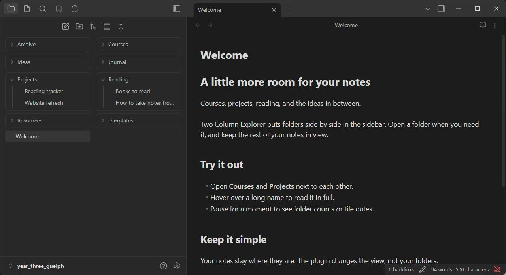
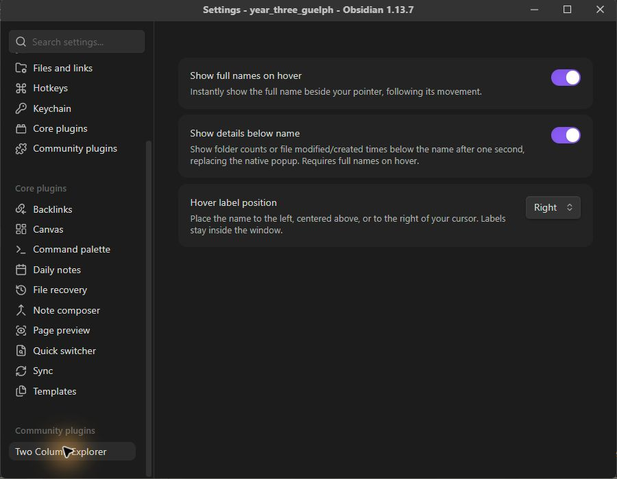

# Two Column Explorer

A little more room for your notes.

Two Column Explorer puts your folders and files side by side in Obsidian's sidebar. See more of your vault at a glance, open folders in place, and hover over a shortened name to read the whole thing.

## What it does

- **Two columns in your usual file explorer.** Top-level folders and files sit side by side, with a gap between them.
- **Folders open in their own column.** Nested folders keep their familiar indented layout.
- **Full names when you need them.** A name label appears immediately and follows your mouse. Choose whether it sits to the left, in the center, or to the right of the cursor.
- **Details after a short pause.** Keep hovering for one second to see folder counts, or a file's last modified and created times, beneath its name.

Your folders stay where they are. The plugin changes how the explorer looks; it doesn't move, rename, or edit your notes.

## Getting started

Enable **Two Column Explorer** and open the file explorer. That's it. Drag the edge of the sidebar to give longer names more room.

To return to the usual layout, disable the plugin under **Settings → Community plugins**.

### Install manually

Until the plugin is available in the community directory:

1. Download `main.js`, `manifest.json`, and `styles.css` from a release.
2. Put those three files in `<your vault>/.obsidian/plugins/two-column-explorer/`.
3. Restart Obsidian, then enable **Two Column Explorer** under **Settings → Community plugins**.

If you download the plugin ZIP instead, extract the `two-column-explorer` folder into your vault's `.obsidian/plugins/` folder.

## Make the hover label yours

Open **Settings → Two Column Explorer**.

| Setting                  | What it does                                                                                                                                    |
| ------------------------ | ----------------------------------------------------------------------------------------------------------------------------------------------- |
| Show full names on hover | Shows the complete folder or file name beside your mouse. On by default.                                                                        |
| Show details below name  | Adds folder counts or file dates after one second. Turn it off to use Obsidian's separate details popup. Requires the name label to be enabled. |
| Hover label position     | Places the label to the **Left**, **Center**, or **Right** of your cursor. Right is the default.                                                |

Long names wrap in the label, and it stays inside the window. Move away, scroll, or press Escape to dismiss it.

## A few things to know

- The screenshots use Obsidian's default theme and fictional demo notes. No theme or other community plugin is needed.
- Two columns stay enabled at any sidebar width. A wider sidebar makes names easier to read.
- Opening a tall folder makes that row taller, so there may be empty space beneath the folder beside it.
- Tested on Obsidian 1.13.7 for Windows. Mobile and older versions haven't been verified.
- Very large expanded folder trees may use more memory. The plugin adapts Obsidian's internal file explorer, so future Obsidian updates may need a compatibility fix.

The plugin doesn't make network requests or collect analytics.

## Found a problem?

Open an issue in this repository with your Obsidian version, operating system, and theme. A screenshot and the steps that led to the problem are helpful. Please hide any private note names before sharing.
